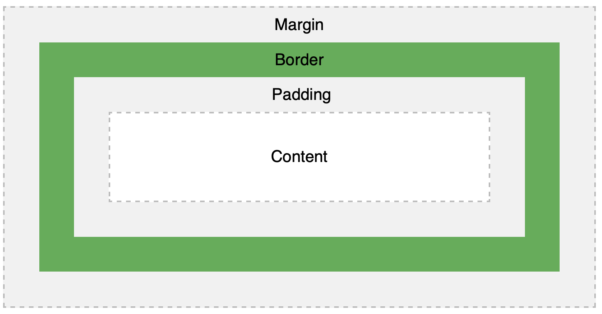

CSS is Cascading Style Sheets. It describes how HTML elements are displayed on a media. External stylesheets are stored in CSS files. 


## CSS Syntax

A CSS rule-set consists of a selector and a declaration block. 

- Selector points to the HTML elements on which the style applies
- Declaration block contains one or more style declarations
- Each declaration include a CSS property name and a value. 

**Example**:

```css
p {
  color: red;
  text-align: center;
}
```


### CSS Selectors

In general, CSS selectors can be divided into five types:

- **Simple**: select elements based on name, id, class
- **Combinator selectors**: select elements based on their relationship
- **Pseudo-class selector**: select elements based on a certain state
- **Pseudo-elements selector**: select and style a part of an element
- **Attribute selector:** select elements based on an attribute or attribute value


#### Select by element name

Select all `<p>` elements and apply the style.

```css
p {
  text-align: center;
  color: red;
}
```


#### Select by id attribute of an HTML element

Select all HTML elements with `id="para1"`

```css
#para1 {
  text-align: center;
  color: red;
}
```


#### Select by class

Select all HTML elements with `class="center"`:

```css
.center {
  text-align: center;
  color: red;
}
```


Select only `<p>` elements with `class="center"`:

```css
p.center {
  text-align: center;
  color: red;
}
```


**HTML elements can refer to more than one class:**

```html
<p class="center large">This paragraph refers to two classes.</p>
```


#### Select multiple HTML elements at once

Select `<h1>, <h2>, <p>` at once:

```css
h1, h2, p {
  text-align: center;
  color: red;
}
```


### CSS Combinators

There are four CSS combinators:

- Descendant selector (space)
- Child selector (>)
- Adjacent sibling selector (+)
- General sibling selector (~)

```css
/*Select all p element inside div*/
div p {
  background-color: yellow;
}
```

```css
/*Select all p elements that are children of a div*/
div > p {
  background-color: yellow;
}
```

```css
/*Select all p elements that are placed immediately after div elements*/
div + p {
  background-color: yellow;
}
```

```css
/*Select all p elements that are siblings of div elements*/
div ~ p {
  background-color: yellow;
}
```


### Pseudo-classes

A pseudo-class is used to define a special state of an element such as mouse over or get focus.

```css
/* unvisited link */
a:link {
  color: #FF0000;
}

/* visited link */
a:visited {
  color: #00FF00;
}

/* mouse over link */
a:hover {
  color: #FF00FF;
}

/* selected link */
a:active {
  color: #0000FF;
}

/*Note: a:hover MUST come after a:link and a:visited in the CSS definition in order to be effective! a:active MUST come after a:hover in the CSS definition in order to be effective! Pseudo-class names are not case-sensitive.*/
```

List of pseudo-classes: https://www.w3schools.com/css/css_pseudo_classes.asp


### Pseudo-elements

A CSS pseudo-element is used to style a specified part of an element, such as first letter or line of an element. It is also used to insert content before, or after the content of an element. 

```css
/*Insert smiley before and after h1*/
h1::before {
  content: url(smiley.gif);
}

h1::after {
  content: url(smiley.gif);
}

/*Notice the use of two colons ::*/
```


List of pseudo-elements: https://www.w3schools.com/css/css_pseudo_elements.asp


## CSS Box Model

The CSS box model is a box that wraps around every HTML element. It consists of:

- Margins
- Borders
- Padding
- Actual content



Knowing how the box model works is crucial for setting width and height of elements.


### Setting Elements Height and Width

When we set width and height, we only set the size of the content. We need to account for padding, border, and margin when we calculate the size of elements. 

`Total element width = width + left padding + right padding + left border + right border + left margin + right margin`

`Total element height = height + top padding + bottom padding + top border + bottom border + top margin + bottom margin`


Possible values of the `height` and `width` properties:

- `auto` : browser calculates the height and width
- `length` : define the height and width in px, cm, etc. 
- `%` : define the height/width in percentag of the container
- `initial` : set height/width to its default value
- `inherit` : inherit height/width from its parent value


The property `max-width` allows setting the maximum width of an element. It allows the element to stretch to that size, however, the browser and shrink it should the viewport of the browse is smaller. If we use only `width`, the browser would not be able to shrink the element. 


### Setting Margins

Shorthand description of margin: 

- `top, right, bottom, left`
- `top, left & right, bottom`
- `top & bottom, left & right`

**Setting margin `auto` to horizontally center the element within its container.** The element will take up the specified width, and split the remaining space equally between left and right margins. 


## CSS Layout

### Display Property

The `display` property controls if/how an element is displayed. Every HTML element has a default display value.


#### Block-level Element

A block-level element always **starts on a new line and takes up the full width avalable** (i.e., stretching to the left and right as far as it can.)

Examples:

- `<div>`
- `<h1>` to `<h6>`
- `<p>`
- `<form>`


#### Inline element

An inline element does not start on a new line and only takes up as much width as necessary. 

Examples:

- `<span>`
- `<a>`
- ``

```css
/*This is a common trick, making inline li elements for horizontal menus*/
li {
  display: inline;
}
```


#### Inline-block

An inline-block element **allows us to set width and height**. Moreover, its top and bottom margins / paddings ar respected. However, **no line-break is added after the element**. 

```css
/*A common use of inline-block is to create horizontal navigation links*/
.nav {
  background-color: yellow; 
  list-style-type: none;
  text-align: center; 
  padding: 0;
  margin: 0;
}

.nav li {
  display: inline-block;
  font-size: 20px;
  padding: 20px;
}
```


#### Center elements horizontally

Use `margin : auto` and set its width to center align elements

```css
.center {
  margin: auto;
  width: 50%;
  border: 3px solid green;
  padding: 10px;
}
```


Use `text-align : center` to center align text within an element

```css
.center {
  text-align: center;
  border: 3px solid green;
}
```


Use `display : block` and `margin : auto` to center an image. The reason is that because imgs are inline elements and thus its layout cannot be controlled. 

```css
img {
  display: block;
  margin-left: auto;
  margin-right: auto;
  width: 40%;
}
```


#### Left and Right Align elements

Using `position : absolute` to align elements:

```css
.right {
  position: absolute;
  right: 0px;
  width: 300px;
  border: 3px solid #73AD21;
  padding: 10px;
}
```


Using `float`:

```css
.right {
  float: right;
  width: 300px;
  border: 3px solid #73AD21;
  padding: 10px;
}
```


#### Center vertically

Use same top and bottom `padding`:

```css
.center {
  padding: 70px 0;
  border: 3px solid green;
  text-align: center;
}
```


Use absolute positioning and transform:

```css
/*This is the container*/
.center { 
  height: 200px;
  position: relative;
  border: 3px solid green; 
}

/*This p is inside the container*/
.center p {
  margin: 0;
  position: absolute;
  top: 50%;
  left: 50%;
  transform: translate(-50%, -50%);
}
```


### The Position property

The `position` property specifies the type of positioning method to be used for an element:

- **Static**: Default mode. The element is positioned according to the normal flow of the page. Thus, `top, bottom, left, right` property has no effect.
- **Relative**: The element is position relative to its normal position. The use of `top, bottom, left, right` will move the position from its normal position. Other elements will not fill in the gap. 
- **Fixed**: The element is positioned relative to the viewport, meaning that it will always stay in the same place even if the page is scrolled. A fixed element does not leave a gap in the page where it would normally be. 
- **Absolute**: The element is position relative to the nearest **positioned** ancestor. A positioned element is anything but static position.
- **Sticky**: The position is positioned based on the user's scroll position. Technically, it toggles between relative and fixed. 


Example of absolute position:

```css
div.relative {
  position: relative;
  width: 400px;
  height: 200px;
  border: 3px solid #73AD21;
} 

div.absolute {
  position: absolute;
  top: 80px;
  right: 0;
  width: 200px;
  height: 100px;
  border: 3px solid #73AD21;
}
```


Example of sticky position:

```css
div.sticky {
  position: -webkit-sticky; /* Safari */
  position: sticky;
  top: 0;
  background-color: green;
  border: 2px solid #4CAF50;
}
```

